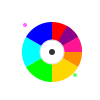

    
    <!--  -->

## Philosophy

We believe the next generation of AI will move beyond mere automation to become a true partner in human thought, learning, and creative expression. At InnerAurora, we explore and build foundational tools and applications at this potent intersection.

Our purpose is to develop AI-driven systems that:

- **Deepen Understanding:** Foster more reflective, resonant, and meaningful interactions between humans and intelligent systems.
- **Amplify Creativity:** Empower individuals to generate unique, beautiful, and impactful creative assets with AI as a co-pilot.
- **Unlock Potential:** Provide the infrastructure and insights for a future where technology enhances our cognitive and creative capabilities in truly symbiotic ways.

## Projects

We are pioneering the future of digital design through two core projects, each designed for a different creative workflow.

###  `1.`  [HyperWeave MCP](https://github.com/InnerAurora/hyperweave-mcp)

*The Engine for AI-Powered Vector Graphics*

A powerful backend service that connects generative AI models to your creative workflow, producing unique, production-ready SVG assets programmatically.

- **Powerful MCP Server:** Connecting AI models to generate SVG banners, badges, buttons, and more.
- **Simple Client & API:** For easy integration into your applications and documentation workflows.
- **Cohesive Theme Generation:** Enabling the creation of cohesive and aesthetically striking visual systems.

Explore how AI can revolutionize your visual design workflow [here][hyperweave-mcp]

### `2.`  [HyperWeave Studio](https://github.com/InnerAurora/hyperweave-mcp)

*Your Web-Based AI Design Partner*

Our upcoming visual application that puts the power of generative AI into the hands of designers and creators. No coding required.

- **AI-Powered Suggestions:** Context-aware design recommendations to enhance creativity.
- **Intuitive Design Tools:** Drag-and-drop interface for creating and customizing SVG graphics.
- **Production-Ready Exports:** Seamless export of assets for use in web, mobile, and print applications.

View the project roadmap and contribute to the design of the future [here][hyperweave-mcp]

## Get Involved

InnerAurora is built in the open by a community of developers, designers, and visionaries. Whether you want to contribute code, share ideas, or simply follow our progress, there's a place for you.

- **Contribute on GitHub:** Dive into our code, report issues, or submit pull requests. We welcome contributions to our core projects.
  - [Explore Repositories][hyperweave-mcp]

- **Join the Conversation:** Chat with the team and community on our Discord server. It's the best place to ask questions, share your creations, and get real-time help.
  - [Start Chatting][discord]

- **Follow Our Progress:** Stay updated with the latest news, feature releases, and project milestones by following us on X[x].
  - [View Updates][x]

- **Understand the Vision:** Read our manifesto to learn about the core philosophy and long-term vision driving our work on human-AI symbiosis.
  - [Read the Manifesto][x]

Let's shape the future of human-AI symbiosis, together.

---

<!-- REFERENCE LINKS -->
[discord]: https://discord.gg/hyperweave.app
[x]: https://x.com/hyperweave_app

[hyperweave-mcp]: https://github.com/InnerAurora/hyperweave-mcp
